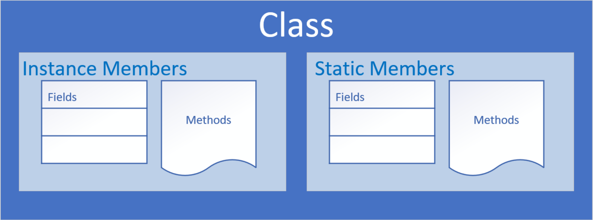

# Object Oriented Programming

## What is Object-Oriented Programming?

Object-Oriented Programming is a way to model real-world objects as software objects which contain both data and code.
OOP is a common acronym for Object-Oriented Programming.

## Class-based Programming

Class-based programming starts with classes which become the blueprints for objects.

To start, we need to understand what objects are.
They're really the key to understanding this object-oriented terminology.

## Real World Object Exercise

What I'd like you to do is just have a look around in the area you're sitting in right now.
And if you do that, you'll find that there's many examples of real-world objects.
For example, I'm sitting here, and I can see:

- A computer.
- I can see a keyboard.
- I can see a microphone.
- I can see shelves on the wall.
- I can see a door.

All of these are examples of real-world objects.

## State and Behavior

Real-world objects have two major components:

- state
- behavior

### State

in terms of a computer object, might be:

- The amount of RAM it has.
- The operating system it's running.
- The hard drive size.
- The size of the monitor.

These are characteristics about the item that can describe it.

For an ant, the state might be:

- The age
- The number of legs
- The conscious state
- Whether the ant is sleeping or is awake

### Behaviour

In addition to state, objects may also have behavior or actions that can be performed by the object, or upon the object.

Behavior, for a computer, might be things like:

- Booting up
- Shutting down
- Beeping or outputting some form of sound
- Drawing something on the screen, and so on

All of these could be described as behaviors for a computer.

For an ant, behavior might be:

- Eating
- Drinking
- Fighting
- Carrying food, those types of things.

Modelling real-world objects as software objects is a fundamental part of Object-Oriented Programming.

A software object stores its state in fields, which can also be called variables or attributes.

Objects expose their behavior with methods which I've talked about before.

So, where does a class fit in?
Well, think of a class as a template or a blueprint for creating objects.

## The class as the blueprint

The class describes the data (fields), and the behavior (methods), that are relevant to the real-world object we want to describe.

These are called class members.



A class member can be a field or a method, or some other type of dependent element.

If a field is static, there is only one copy in memory, and this value is associated with the class or template itself.

If a field is not static, it's called an instance field, and each object may have a different value stored for this field.

A static method can't be dependent on any one object's state, so it can't reference any instance members.

In other words, any method that operates on instance fields needs to be non-static.

## Organizing classes

Classes can be organized into logical groupings which are called packages.

You declare a package name in the class using the package statement.

If you don't declare a package, the class implicitly belongs to the default package.

## Access modifiers for the class

A class is said to be a top-level class if it is defined in the source code file and not enclosed in the code block of another class, type, or method.

A top-level class has only two valid access modifier options: public or none.

| Access keyword | Description                                                                                                                                         |
|----------------|-----------------------------------------------------------------------------------------------------------------------------------------------------|
| public         | public means any other class in any package can access this class.                                                                                  |
| none           | When the modifier is omitted, this has special meaning, called package access, meaning the class is accessible only to classes in the same package. |

## Access modifiers for class members

| Access keyword | Description                                                                                                                                         |
|----------------|-----------------------------------------------------------------------------------------------------------------------------------------------------|
| public         | public means any other class in any package can access this class.                                                                                  |
| protected      | protected allows classes in the same package, and any subclasses in other packages, to have access to the member.                                   |
| none           | When the modifier is omitted, this has special meaning, called package access, meaning the member is accessible only to classes in the same package |
| private        | private means that no other class can access this member                                                                                            |

## Encapsulation

Encapsulation in Object-Oriented Programming usually has two meanings.

One is the bundling of behavior and attributes on a single object.

The other is the practice of hiding fields and some methods from public access.

## What is null?

`null` is a special keyword in Java, meaning, the variable or attribute has a type but no reference to an object.

This means that no instance or object is assigned to the variable or field.

Fields with primitive data types are never null.

## Default values for fields on classes

Fields on classes are assigned default values automatically by Java, if you don't assign values yourself.

| Datatype                                 | Default value assigned |
|------------------------------------------|------------------------|
| boolean                                  | false                  |
| byte <br>short <br>int <br>long <br>char | 0                      |
| double <br>float                         | 0.0                    |

## What are getters and setters? Why should we use them?

A **getter** is a method on a class that retrieves the value of a private field and returns it.  
A **setter** is a method on a class that sets the value of a private field.   

The purpose of these methods is to control and protect access to private fields.

## Constructor

A **constructor** is used in the creation of an object.
It is a special type of code block that has a specific name and parameters, much like a method.
It has the same name as the class itself, and it doesn't return any values.

You never include a return type from a constructor, not even void.

You can, and should, specify an appropriate access modifier to control who should be able to create new instances of the class, using this constructor.

```java
public class Account { // This is the class declaration
    public Account() { // This is the constructor declaration
        // Constructor code is code to be executed as the object is created.
    }
}
```

## The default constructor

If a class contains no constructor declarations, then a default constructor is implicitly declared.

This constructor has no parameters and is often called the no-args (no arguments) constructor.

If a class contains any other constructor declarations, then a default constructor is NOT implicitly declared.

## Constructor overloading

Constructor overloading is declaring multiple constructors with different parameters.

The number of parameters can be different between constructors.

Or if the number of parameters is the same between two constructors, their types, or order of the types must differ.

## Constructor chaining with `this()`

Constructor chaining is when one constructor explicitly calls another overloaded constructor.
You can only use constructor chaining, within constructors.

You must use the special statement `this()` to execute another constructor, passing it arguments if required.
And `this()` must be the first executable statement if it's used from another constructor.

## Reference vs Object vs Instance vs Class

By now, you've probably noticed that I use the words reference, object, instance and class frequently.
These new concepts may well be confusing at first.

- You create an object by ‘instantiating a class’
- You can create many objects using a single class. Each may have unique attributes or values
- Object and instance are interchangeable terms

Let's use the analogy of building a house to understand classes.
A class is basically a blueprint for the house.
Using the blueprint, we can build as many houses as we like based on those plans.
Each house we build (in other words, going back to programming terms, each house we instantiate using the new operator) is an object.
This object can also be known as an instance. Often, we'll say it's an instance of the class.  So, we would have an instance of house in this example.
Getting back to the physical world, each house we build has an address (it's built at a physical location).
In other words, if we want to tell someone where we live, we give them our address (perhaps written on a piece of paper). This is known as a reference.

